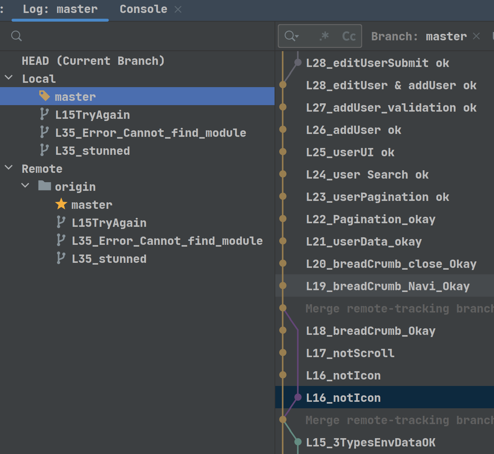

# vueLearn
vue学习笔记，
### 参考视频
https://www.bilibili.com/video/BV1rt4y177QW
### 本项目Repo
https://github.com/GWillS163/vuelearn.git
### 提交记录
有点乱，不过没关系，主要是为了学习。

## Project setup
```
yarn install
```

### Compiles and hot-reloads for development
```
yarn serve
```

### Compiles and minifies for production
```
yarn build
```

### Lints and fixes files
```
yarn lint
```

### Customize configuration
See [Configuration Reference](https://cli.vuejs.org/config/).
